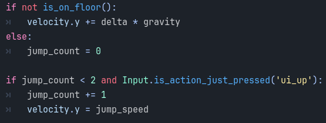
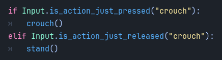
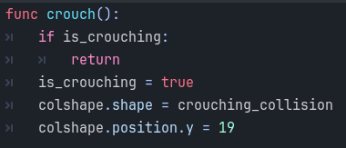
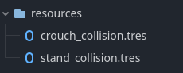
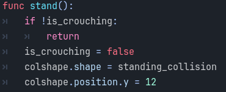
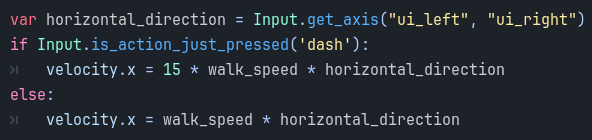
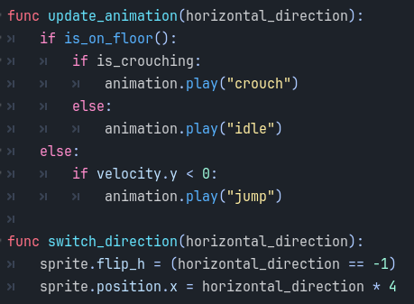

<h2>Tutorial 3</h2>

I've implemented double jump (press arrow up twice), crouch (press arrow down), and dash (press shift while walking right or left with the arrows). I also polished it by adjusting the sprite direction when the character moves right and left. I also adjusted the sprite depending on the movement the character is doing (jumping/crouching/default when idle or walking). I would loved to explore with more movements and animations in the future.

1. Double Jump
 
I added that to limit the jump count to twice.

2. Crouch 
This one was tricky! 
 
 
 
I added a new function for crouching which would update the state and change the collision shape of the character to be shorter. I also adjusted the y.axis position of the collision shape because otherwise, the collision shape would be placed at the center of the sprite and not reach the bottom of the character. 
 
Of course, I had to adjust the collision shape position back to where it was if the character was standing, which is achieved by the shape above.

3. Dash 
 
For this one, I only sped up the character's velocity if the dash (shift) button was pressed.

4. Polishing 
These two functions helped me update the sprite depending on the movement and flip the sprite depending on the direction the character is facing.

References 
For crouching: https://youtu.be/Hpbn-w7H2V4?si=aNdjwC0G1T-PbYzh  
For double jump: https://youtu.be/DW4CQoYddXQ?si=Rk-X0PkSdQlJSSZE

