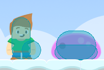
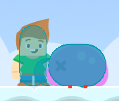
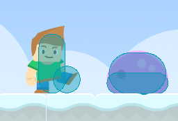
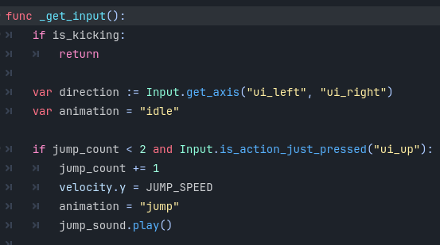
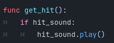

<h2>Tutorial 3</h2>

I've implemented double jump (press arrow up twice), crouch (press arrow down), and dash (press shift while walking right or left with the arrows). I also polished it by adjusting the sprite direction when the character moves right and left. I also adjusted the sprite depending on the movement the character is doing (jumping/crouching/default when idle or walking). I would loved to explore with more movements and animations in the future.

1. Double Jump
 
I added that to limit the jump count to twice.

2. Crouch 
This one was tricky! 
 
 
 
I added a new function for crouching which would update the state and change the collision shape of the character to be shorter. I also adjusted the y.axis position of the collision shape because otherwise, the collision shape would be placed at the center of the sprite and not reach the bottom of the character. 
 
Of course, I had to adjust the collision shape position back to where it was if the character was standing, which is achieved by the shape above.

3. Dash 
 
For this one, I only sped up the character's velocity if the dash (shift) button was pressed.

4. Polishing 
These two functions helped me update the sprite depending on the movement and flip the sprite depending on the direction the character is facing.

References 
For crouching: https://youtu.be/Hpbn-w7H2V4?si=aNdjwC0G1T-PbYzh  
For double jump: https://youtu.be/DW4CQoYddXQ?si=Rk-X0PkSdQlJSSZE

<h2>Tutorial 5</h2>
In this tutorial, I expanded upon what I did in tutorial 3. I used AnimatedPlayer last time, but as per the instructions for this tutorial, I created a new player, Player2, that uses AnimatedSprite2D.

1. **Combining my mechanics from last tutorial with the script given in this tutorial** 
This tutorial doesn't provide double jump and crouch, but I implemented it in tutorial 3, so I integrated it into this one in player_2.gd
2. **Adding another animated object** 
I added a purple slime from Kenney Assets [here](https://kenney.nl/assets/platformer-pack-redux). This purple slime can be hit 3 times until it dies. After it dies, its collision shape will become bigger, allowing the player to jump on top of it. 
 
3. **Setting up interaction with object** 
The player can kick the slime until it dies. Afterwards, they can jump on top of the slime to reach higher places that can't be reached with a mere double jump. 
 
The character has a KickArea (Area2D) that only activates during the kick and when detected by the slime's HitboxArea (Area2D), damages the slime until it dies.
4. **Added SFX** 
I added two sound effects, one for jumping and one for damage to the slime, both generated with [jsfxr](https://sfxr.me/). 
Jump sound: 
 
Slime damage: 
 
5. **Added BGM** 
I added a fun background track by josefpres from [freesound.org](https://freesound.org/people/josefpres/sounds/792323/).
6. **Added things I learned from tutorial 4** 
I wouldn't say this is polishing because it isn't truly polished, but as I learned in tutorial 4, I added an area where the game can reset if the player falls, and a win area (plus a winning screen that can be pressed).

